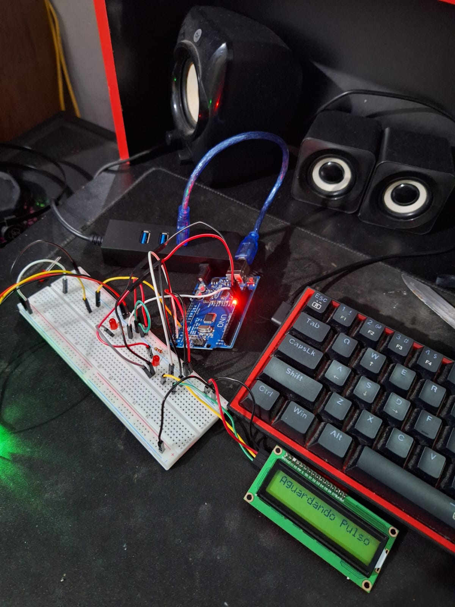
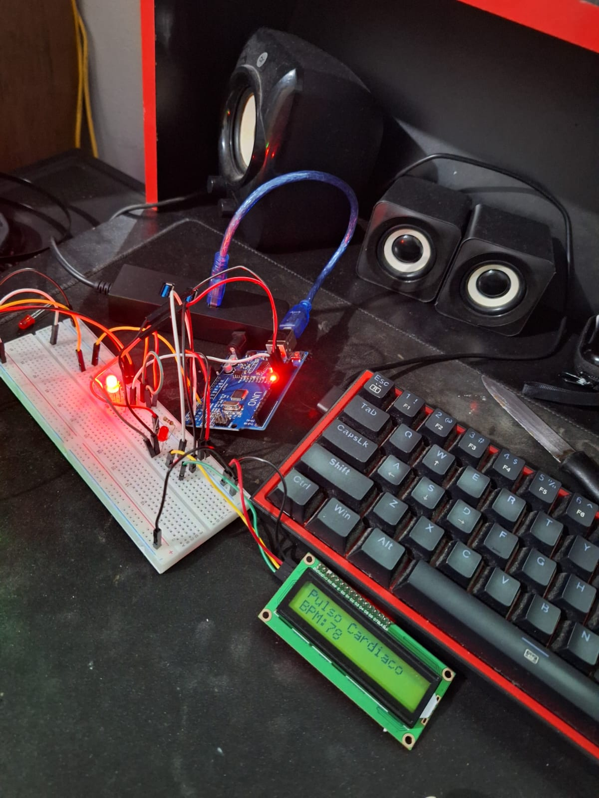
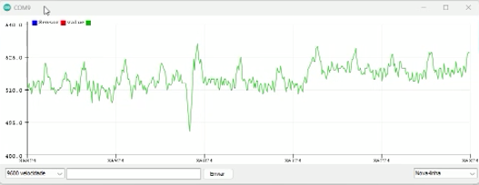

# Sensor de Pulso (Arduino)

Este projeto utiliza um sensor de pulso para monitorar a frequência cardíaca de uma pessoa e exibir o resultado em tempo real em um display LCD. O projeto também acende LEDs para indicar a detecção de batimentos e utiliza um filtro de média móvel para suavizar os valores de BPM (batimentos por minuto) exibidos no LCD.

## Imagens

## Componentes Necessários

- **Arduino (Uno, Nano ou similar)**
- **Sensor de Pulso (PulseSensor)**
- **Display LCD 16x2 com interface I2C**
- **LEDs (opcional, pino 13 para batimento e pino 12 para indicação de batimento)**
- **Resistores (para LEDs)**
- **Fios de conexão**

## Diagrama de Conexões

- **Sensor de Pulso**: Conecte o fio roxo ao pino analógico A0 do Arduino.
- **LEDs**:
  - **LED no pino 13**: Para indicar o batimento cardíaco.
  - **LED no pino 12**: Para indicar a detecção de batimento (acende quando detecta um batimento).
- **Display LCD I2C**: Conecte os pinos **SDA** e **SCL** do display aos pinos correspondentes do Arduino.

## Descrição do Código

### Bibliotecas Utilizadas

- **PulseSensorPlayground**: Biblioteca para interface com o sensor de pulso.
- **Wire**: Biblioteca para comunicação I2C (necessária para o display LCD).
- **LiquidCrystal_I2C**: Biblioteca para controlar o display LCD com interface I2C.

### Variáveis e Definições

- `PulseWire`: Define o pino analógico ao qual o sensor de pulso está conectado (A0).
- `LED13` e `LED12`: Definem os pinos dos LEDs no Arduino (pinos 13 e 12).
- `Threshold`: Limiar para a detecção do batimento cardíaco (valor padrão 777).
- `pulseSensor`: Objeto para controle do sensor de pulso.
- `lcd`: Objeto para controle do display LCD.
- `readings`: Buffer para armazenar as leituras de BPM e realizar a média móvel.
- `averageBPM`: Média dos BPMs, que é calculada a partir das leituras armazenadas.

### Funções Importantes

- **`setup()`**: Inicializa o LCD, o sensor de pulso, os LEDs e a comunicação serial. Realiza a verificação de inicialização do sensor.
- **`loop()`**:
  - Verifica se o sensor detectou um batimento cardíaco.
  - Atualiza o LCD com a frequência cardíaca média.
  - Acende o LED no pino 12 quando um batimento é detectado.
  - Exibe "Aguardando Pulso..." no LCD quando não há detecção de batimento por um tempo.
  - Utiliza um filtro de média móvel para suavizar os valores de BPM.

## Funcionamento

1. **Início**: Quando o circuito é ligado, o LCD exibe "Monitor BPM". O sensor de pulso começa a medir os batimentos cardíacos e envia essas informações para o Arduino.
2. **Detecção de Batimento**: Quando o sensor detecta um batimento, o LED no pino 12 acende e o BPM é calculado e exibido no LCD.
3. **Atraso entre batimentos**: O sistema utiliza um pequeno atraso para evitar leituras excessivas, e a média dos BPMs é calculada para uma medição mais estável.
4. **Aguardando Pulso**: Quando não há um batimento detectado por um certo tempo, o LCD exibe a mensagem "Aguardando Pulso...", e o LED no pino 12 é apagado.

## Melhorias Possíveis

- **Alerta sonoro**: Adicionar um buzzer para emitir um som quando um batimento cardíaco for detectado.
- **Gráfico de BPM**: Adicionar um gráfico ou barra de progresso no LCD para representar visualmente os batimentos cardíacos.
- **Envio de dados**: Enviar os dados de BPM para um aplicativo ou banco de dados para monitoramento remoto.

## Licença

Este projeto é distribuído sob a licença MIT - veja o arquivo [LICENSE](LICENSE) para mais detalhes.

## Agradecimentos

- **PulseSensorPlayground**: Biblioteca usada para facilitar a interface com o sensor de pulso.
- **LiquidCrystal_I2C**: Biblioteca usada para simplificar o controle do display LCD via I2C.

## Referências

- [Sensor Pulse Sensor - Página oficial](https://pulsesensor.com)
- [Arduino](https://www.arduino.cc)
- [LiquidCrystal_I2C - GitHub](https://github.com/fmalpartida/LiquidCrystal_I2C)

